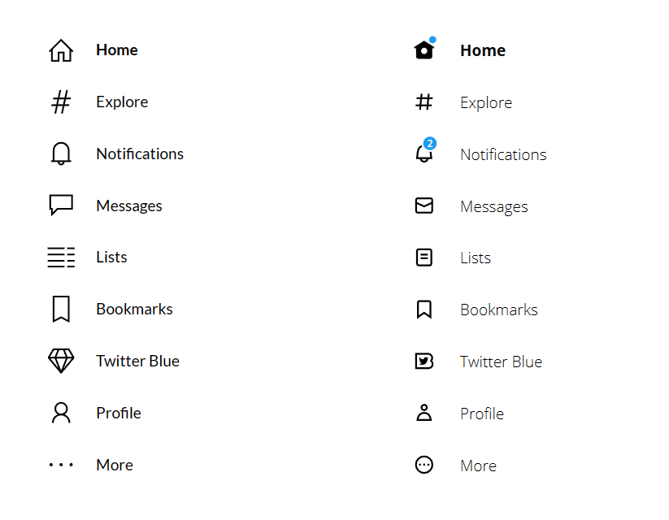

# Exercise 1: Building the menu

In the first exercise we will build a menu that resembles the twitter side menu. The left version are the main quests, the right version includes the side quests.




## Main Quests overview

1. [Create a menu collection](#user-content-create-a-menu-collection)
2. [Create a gallery](#user-content-create-a-gallery)
3. Use the OnSelect-property properly
4. Highlight the selected menu item

## [Side quests overview](#user-content-side-quests)

1. throw in the real svg's
2. toggle the svg's
3. add in the blue details in `home` and `notifications`

## Main quests

Create an empty Canvas App from scratch in an environment of your choice. We WON'T use any special features that may be blocked by your admins. We als WON'T actually connect to the twitter API. So don't worry, every environment will do.

### Create a menu collection

This is the twitter-menu for reference (when logged in). We want to create a Power FX collection, that contains all the information we see in the menu.


We will need:
* an ID (will be important for the OnSelect-property, stay tuned!)
* the label
* an icon that roughly matches the twitter icons (we will use internal PowerApps icons in the first quick iteration)

Add this piece of code to the `OnStart`-property of your App and run it.

```
ClearCollect(
    colMenu,
    {id: 1, text: "Home", icon: Icon.Home},
    {id: 2, text: "Explore", icon: Icon.TrendingHashtag},
    {id: 3, text: "Notifications", icon: Icon.Bell},
    {id: 4, text: "Messages", icon: Icon.Message},
    {id: 5, text: "Lists", icon: Icon.DetailList},
    {id: 6, text: "Bookmarks", icon: Icon.Bookmark},
    {id: 7, text: "Twitter Blue", icon: Icon.Diamond},
    {id: 8, text: "Profile", icon: Icon.Person},
    {id: 9, text: "More", icon: Icon.More}
)
```

### Create a gallery

We will create a simple gallery with an icon in the background and a transparent button in front of it.

**Insert a `Blank vertical gallery`**
* Set the `TemplateSize` to `58`
* Set the `TemplatePadding` to `0`

**Insert an `Icon` inside the gallery**
* Set the `Color` to `Color.Black`
* Set the `Icon`-property to `ThisItem.icon`

**Insert a `Button` inside the gallery**
* Set the `Text` to `ThisItem.text`
* Set the `Height` to `50`
* Set `X` and `Y` to `4`
* Set the `Fill` to `Color.Transparent`
* Set the `Color` to `Color.Black`
* Align the text to the left
* Set the `PaddingLeft` to `70`

The tree view of our gallery should look like this (after renaming the elements)


Add some finishing touches to the gallery styling and your result should look like this


### Use the OnSelect-property

Of course we created the menu to click on the buttons. We have 9 menu items but only one button we can work with.

We will use this code on the button inside the gallery on the `OnSelect`-property.

First we remember which item we clicked and store it in `varMenuItem`.

Afterwards we use `Switch()` to distinguish between the actions between clicking button 1 to 9. Those could navigate to different screens, open modal windows or do whatever we need in our apps.

```
//we can use this to change parts of the UI if we need to
Set(varMenuItem, ThisItem.id);

//This is the immediate action that happen on the click
Switch(ThisItem.id,
    //click on 1st menu item
    1, Notify("ACTION"),

    //click on 2nd menu item
    2, Notify("DIFFERENT ACTION", NotificationType.Success),

    //click on 3rd menu item
    3, Notify("Even more ACTION", NotificationType.Error)

    //... repeat till 9
)
```

### Highlight the selected item

In order to highlight the selected item we want to change the button text from a leight to a bold font weight.

We will use this code on the `FontWeight` property of the button.

```
If(
    ThisItem.id = varMenuItem,
    FontWeight.Bold,
    FontWeight.Lighter
)
```

This should give us this effect after clicking on a menu item.


## Side quests


 


