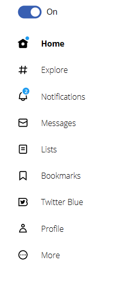
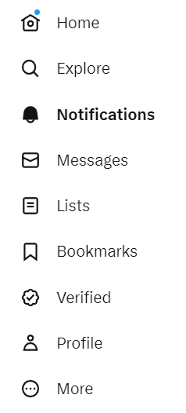
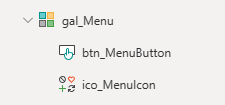
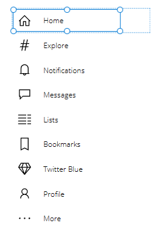
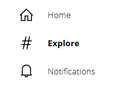
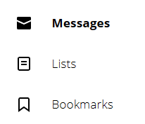
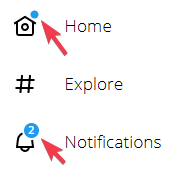

# Exercise 2: Turn the menu into a component

In the second exercise we will take our shiny menu and we'll turn it into a component to use it on multiple screens and add some functionality.




## [Main Quests overview](#user-content-main-quests)

1. [Create a component](#user-content-create-a-menu-collection)
2. [Add properties to the component](#user-content-create-a-gallery)
3. [Add a behavourial property](#user-content-use-the-onselect-property)
4. [Expand and retract functionality](#user-content-highlight-the-selected-menu-item)

## [Side quests overview](#user-content-side-quests)

1. [Add styling properties](#user-content-throw-in-the-real-svgs)

## Main quests

Create an empty Canvas App from scratch in an environment of your choice. We WON'T use any special features that may be blocked by your admins. We als WON'T actually connect to the twitter API. So don't worry, every environment will do.

### Create a menu collection

This is the twitter-menu for reference (when logged in). We want to create a Power FX collection, that contains all the information we see in the menu.



We will need:
* an ID (will be important for the OnSelect-property, stay tuned!)
* the label
* an icon that roughly matches the twitter icons (we will use internal PowerApps icons in the first quick iteration)

Add this piece of code to the **OnStart**-property of your App and run it.

```
ClearCollect(
    colMenu,
    {id: 1, text: "Home", icon: Icon.Home},
    {id: 2, text: "Explore", icon: Icon.TrendingHashtag},
    {id: 3, text: "Notifications", icon: Icon.Bell},
    {id: 4, text: "Messages", icon: Icon.Message},
    {id: 5, text: "Lists", icon: Icon.DetailList},
    {id: 6, text: "Bookmarks", icon: Icon.Bookmark},
    {id: 7, text: "Twitter Blue", icon: Icon.Diamond},
    {id: 8, text: "Profile", icon: Icon.Person},
    {id: 9, text: "More", icon: Icon.More}
)
```

### Create a gallery

We will create a simple gallery with an icon in the background and a transparent button in front of it.

**Insert a Blank vertical gallery**
* Set the **Items** property to `colMenu`
* Set the **TemplateSize** to `58`
* Set the **TemplatePadding** to `0`

**Insert an Icon` inside the gallery**
* Set the **Color** to `Color.Black`
* Set the **Icon**-property to `ThisItem.icon`

**Insert a Button inside the gallery**
* Set the **Text** to `ThisItem.text`
* Set the **Height** to `50`
* Set **X** and **Y** to `4`
* Set the **Fill** to `Color.Transparent`
* Set the **Color** to `Color.Black`
* Align the text to the left
* Set the **PaddingLeft** to `70`

The tree view of our gallery should look like this (after renaming the elements)



Add some finishing touches to the gallery styling and your result should look like this



### Use the OnSelect-property

Of course we created the menu to click on the buttons. We have 9 menu items but only one button we can work with.

We will use this code on the button inside the gallery on the **OnSelect**-property.

First we remember which item we clicked and store it in `varMenuItem`.

Afterwards we use `Switch()` to distinguish between the actions between clicking button 1 to 9. Those could navigate to different screens, open modal windows or do whatever we need in our apps.

```
//we can use this to change parts of the UI if we need to
Set(varMenuItem, ThisItem.id);

//This is the immediate action that happen on the click
Switch(ThisItem.id,
    //click on 1st menu item
    1, Notify("ACTION"),

    //click on 2nd menu item
    2, Notify("DIFFERENT ACTION", NotificationType.Success),

    //click on 3rd menu item
    3, Notify("Even more ACTION", NotificationType.Error)

    //... repeat till 9
)
```

### Highlight the selected menu item

In order to highlight the selected item we want to change the button text from a leight to a bold font weight.

We will use this code on the **FontWeight** property of the button.

```
If(
    ThisItem.id = varMenuItem,
    FontWeight.Bold,
    FontWeight.Lighter
)
```

This should give us this effect after clicking on a menu item.




## Side quests

### Throw in the real svg's

We will need to expand our collection a bit for all the information we need. The svg paths are taken directly from the homepage with the dev tools. For the first side quests we'll help you a bit so you don't have to extract all the paths.

The new `colMenuEnhanced` also has the `updates`-property on the "Home"-button and `messages`-property on the "Notifications" button. And it has two svg-paths for each icon, on for the selected and one for the normal state.

The new `colMenuEnhanced` looks like this:

```
ClearCollect(
    colMenuEnhanced,
    {id: 1, text: "Home", icon: Icon.Home, width: 130, svg_path:"M12 9c-2.209 0-4 1.791-4 4s1.791 4 4 4 4-1.791 4-4-1.791-4-4-4zm0 6c-1.105 0-2-.895-2-2s.895-2 2-2 2 .895 2 2-.895 2-2 2zm0-13.304L.622 8.807l1.06 1.696L3 9.679V19.5C3 20.881 4.119 22 5.5 22h13c1.381 0 2.5-1.119 2.5-2.5V9.679l1.318.824 1.06-1.696L12 1.696zM19 19.5c0 .276-.224.5-.5.5h-13c-.276 0-.5-.224-.5-.5V8.429l7-4.375 7 4.375V19.5z", svg_selected: "M12 1.696L.622 8.807l1.06 1.696L3 9.679V19.5C3 20.881 4.119 22 5.5 22h13c1.381 0 2.5-1.119 2.5-2.5V9.679l1.318.824 1.06-1.696L12 1.696zM12 16.5c-1.933 0-3.5-1.567-3.5-3.5s1.567-3.5 3.5-3.5 3.5 1.567 3.5 3.5-1.567 3.5-3.5 3.5z", updates: true},
    {id: 2, text: "Explore", icon: Icon.TrendingHashtag, width: 140, svg_path:"M 10.09 3.098 L 9.72 7 h 5.99 l 0.39 -4.089 l 1.99 0.187 L 17.72 7 h 3.78 v 2 h -3.97 l -0.56 6 h 3.53 v 2 h -3.72 l -0.38 4.089 l -1.99 -0.187 l 0.36 -3.902 H 8.78 l -0.38 4.089 l -1.99 -0.187 L 6.77 17 H 2.5 v -2 h 4.46 l 0.56 -6 H 3.5 V 7 h 4.21 l 0.39 -4.089 l 1.99 0.187 Z M 14.96 15 l 0.56 -6 H 9.53 l -0.56 6 h 5.99 Z", svg_selected:"M10.64 3.157l-.36 3.593h4.99l.38-3.892 2.99.299-.36 3.593h2.97v2.5h-3.22l-.55 5.5h2.77v2.5h-3.02l-.39 3.892-2.98-.299.36-3.593H9.23l-.39 3.892-2.98-.299.36-3.593H2.75v-2.5h3.72l.55-5.5H3.75v-2.5h3.52l.38-3.892 2.99.299zm3.83 11.593l.55-5.5h-4.99l-.55 5.5h4.99z"},
    {id: 3, text: "Notifications", icon: Icon.Bell, width: 180, svg_path:"M19.993 9.042C19.48 5.017 16.054 2 11.996 2s-7.49 3.021-7.999 7.051L2.866 18H7.1c.463 2.282 2.481 4 4.9 4s4.437-1.718 4.9-4h4.236l-1.143-8.958zM12 20c-1.306 0-2.417-.835-2.829-2h5.658c-.412 1.165-1.523 2-2.829 2zm-6.866-4l.847-6.698C6.364 6.272 8.941 4 11.996 4s5.627 2.268 6.013 5.295L18.864 16H5.134z", svg_selected:"M11.996 2c-4.062 0-7.49 3.021-7.999 7.051L2.866 18H7.1c.463 2.282 2.481 4 4.9 4s4.437-1.718 4.9-4h4.236l-1.143-8.958C19.48 5.017 16.054 2 11.996 2zM9.171 18h5.658c-.412 1.165-1.523 2-2.829 2s-2.417-.835-2.829-2z", messages: 2},
    {id: 4, text: "Messages", icon: Icon.Message, width: 160, svg_path:"M1.998 5.5c0-1.381 1.119-2.5 2.5-2.5h15c1.381 0 2.5 1.119 2.5 2.5v13c0 1.381-1.119 2.5-2.5 2.5h-15c-1.381 0-2.5-1.119-2.5-2.5v-13zm2.5-.5c-.276 0-.5.224-.5.5v2.764l8 3.638 8-3.636V5.5c0-.276-.224-.5-.5-.5h-15zm15.5 5.463l-8 3.636-8-3.638V18.5c0 .276.224.5.5.5h15c.276 0 .5-.224.5-.5v-8.037z", svg_selected:"M1.998 4.499c0-.828.671-1.499 1.5-1.499h17c.828 0 1.5.671 1.5 1.499v2.858l-10 4.545-10-4.547V4.499zm0 5.053V19.5c0 .828.671 1.5 1.5 1.5h17c.828 0 1.5-.672 1.5-1.5V9.554l-10 4.545-10-4.547z"},
    {id: 5, text: "Lists", icon: Icon.DetailList, width: 120, svg_path:"M3 4.5C3 3.12 4.12 2 5.5 2h13C19.88 2 21 3.12 21 4.5v15c0 1.38-1.12 2.5-2.5 2.5h-13C4.12 22 3 20.88 3 19.5v-15zM5.5 4c-.28 0-.5.22-.5.5v15c0 .28.22.5.5.5h13c.28 0 .5-.22.5-.5v-15c0-.28-.22-.5-.5-.5h-13zM16 10H8V8h8v2zm-8 2h8v2H8v-2z", svg_selected:"M18.5 2h-13C4.12 2 3 3.12 3 4.5v15C3 20.88 4.12 22 5.5 22h13c1.38 0 2.5-1.12 2.5-2.5v-15C21 3.12 19.88 2 18.5 2zM16 14H8v-2h8v2zm0-4H8V8h8v2z"},
    {id: 6, text: "Bookmarks", icon: Icon.Bookmark, width: 170, svg_path:"M4 4.5C4 3.12 5.119 2 6.5 2h11C18.881 2 20 3.12 20 4.5v18.44l-8-5.71-8 5.71V4.5zM6.5 4c-.276 0-.5.22-.5.5v14.56l6-4.29 6 4.29V4.5c0-.28-.224-.5-.5-.5h-11z", svg_selected:"M4 4.5C4 3.12 5.119 2 6.5 2h11C18.881 2 20 3.12 20 4.5v18.44l-8-5.71-8 5.71V4.5z"},
    {id: 7, text: "Twitter Blue", icon: Icon.Diamond, width: 170, svg_path:"M15.704 8.99c.457-.05.891-.17 1.296-.35-.302.45-.685.84-1.125 1.15.004.1.006.19.006.29 0 2.94-2.269 6.32-6.421 6.32-1.274 0-2.46-.37-3.459-1 .177.02.357.03.539.03 1.057 0 2.03-.35 2.803-.95-.988-.02-1.821-.66-2.109-1.54.138.03.28.04.425.04.206 0 .405-.03.595-.08-1.033-.2-1.811-1.1-1.811-2.18v-.03c.305.17.652.27 1.023.28-.606-.4-1.004-1.08-1.004-1.85 0-.4.111-.78.305-1.11 1.113 1.34 2.775 2.22 4.652 2.32-.038-.17-.058-.33-.058-.51 0-1.23 1.01-2.22 2.256-2.22.649 0 1.235.27 1.647.7.514-.1.997-.28 1.433-.54-.168.52-.526.96-.992 1.23zM2 21h15c3.038 0 5.5-2.46 5.5-5.5 0-1.4-.524-2.68-1.385-3.65-.08-.09-.089-.22-.023-.32.574-.87.908-1.91.908-3.03C22 5.46 19.538 3 16.5 3H2v18zM16.5 5C18.433 5 20 6.57 20 8.5c0 1.01-.43 1.93-1.12 2.57-.468.43-.414 1.19.111 1.55.914.63 1.509 1.69 1.509 2.88 0 1.93-1.567 3.5-3.5 3.5H4V5h12.5z", svg_selected:"M16.5 3H2v18h15c3.038 0 5.5-2.46 5.5-5.5 0-1.4-.524-2.68-1.385-3.65-.08-.09-.089-.22-.023-.32.574-.87.908-1.91.908-3.03C22 5.46 19.538 3 16.5 3zm-.796 5.99c.457-.05.892-.17 1.296-.35-.302.45-.684.84-1.125 1.15.004.1.006.19.006.29 0 2.94-2.269 6.32-6.421 6.32-1.274 0-2.46-.37-3.459-1 .177.02.357.03.539.03 1.057 0 2.03-.35 2.803-.95-.988-.02-1.821-.66-2.109-1.54.138.03.28.04.425.04.206 0 .405-.03.595-.08-1.033-.2-1.811-1.1-1.811-2.18v-.03c.305.17.652.27 1.023.28-.606-.4-1.004-1.08-1.004-1.85 0-.4.111-.78.305-1.11 1.113 1.34 2.775 2.22 4.652 2.32-.038-.17-.058-.33-.058-.51 0-1.23 1.01-2.22 2.256-2.22.649 0 1.235.27 1.647.7.514-.1.997-.28 1.433-.54-.168.52-.526.96-.992 1.23z"},
    {id: 8, text: "Profile", icon: Icon.Person, width: 130, svg_path:"M5.651 19h12.698c-.337-1.8-1.023-3.21-1.945-4.19C15.318 13.65 13.838 13 12 13s-3.317.65-4.404 1.81c-.922.98-1.608 2.39-1.945 4.19zm.486-5.56C7.627 11.85 9.648 11 12 11s4.373.85 5.863 2.44c1.477 1.58 2.366 3.8 2.632 6.46l.11 1.1H3.395l.11-1.1c.266-2.66 1.155-4.88 2.632-6.46zM12 4c-1.105 0-2 .9-2 2s.895 2 2 2 2-.9 2-2-.895-2-2-2zM8 6c0-2.21 1.791-4 4-4s4 1.79 4 4-1.791 4-4 4-4-1.79-4-4z", svg_selected:"M17.863 13.44c1.477 1.58 2.366 3.8 2.632 6.46l.11 1.1H3.395l.11-1.1c.266-2.66 1.155-4.88 2.632-6.46C7.627 11.85 9.648 11 12 11s4.373.85 5.863 2.44zM12 2C9.791 2 8 3.79 8 6s1.791 4 4 4 4-1.79 4-4-1.791-4-4-4z"},
    {id: 9, text: "More", icon: Icon.More, width: 120, svg_path:"M3.75 12c0-4.56 3.69-8.25 8.25-8.25s8.25 3.69 8.25 8.25-3.69 8.25-8.25 8.25S3.75 16.56 3.75 12zM12 1.75C6.34 1.75 1.75 6.34 1.75 12S6.34 22.25 12 22.25 22.25 17.66 22.25 12 17.66 1.75 12 1.75zm-4.75 11.5c.69 0 1.25-.56 1.25-1.25s-.56-1.25-1.25-1.25S6 11.31 6 12s.56 1.25 1.25 1.25zm9.5 0c.69 0 1.25-.56 1.25-1.25s-.56-1.25-1.25-1.25-1.25.56-1.25 1.25.56 1.25 1.25 1.25zM13.25 12c0 .69-.56 1.25-1.25 1.25s-1.25-.56-1.25-1.25.56-1.25 1.25-1.25 1.25.56 1.25 1.25z", svg_selected:"M3.75 12c0-4.56 3.69-8.25 8.25-8.25s8.25 3.69 8.25 8.25-3.69 8.25-8.25 8.25S3.75 16.56 3.75 12zM12 1.75C6.34 1.75 1.75 6.34 1.75 12S6.34 22.25 12 22.25 22.25 17.66 22.25 12 17.66 1.75 12 1.75zm-4.75 11.5c.69 0 1.25-.56 1.25-1.25s-.56-1.25-1.25-1.25S6 11.31 6 12s.56 1.25 1.25 1.25zm9.5 0c.69 0 1.25-.56 1.25-1.25s-.56-1.25-1.25-1.25-1.25.56-1.25 1.25.56 1.25 1.25 1.25zM13.25 12c0 .69-.56 1.25-1.25 1.25s-1.25-.56-1.25-1.25.56-1.25 1.25-1.25 1.25.56 1.25 1.25z"}
)
```

To display the svg-paths we can add an html-Text to the gallery and add this code as **HtmlText**, which will display the normal icon:
```
$"<svg width='24px' height='24px' viewBox='0 0 24 24'>
    <path d='{ThisItem.svg_path}'>
</svg>"
```

### Toggle the svg's

Add this effect to the icons:



### Add in the blue details in "home" and "notifications"

Add these (information alredy in the menu collection)


 


