# Exercise 2: Turn the menu into a component

In the second exercise we will take our shiny menu and we'll turn it into a component to use it on multiple screens and add some functionality.


## Main Quests overview

1. Create a component
2. Add properties to the component
3. Add a behavior property
4. Expand and retract functionality
5. Insert the component to your app

## Side quests overview

1. Add styling properties
2. Match the exact text widths of the buttons

## Main quests

To prepare our app we first enable the **Enhanced component properties** in our app settings to use behavior properties later.

Switch that to on:


### 1. Create a component

We start by creating a new component in our app. We will call it `cmp_Menu`.

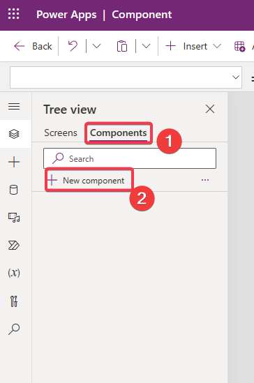

Set the **Width** to `270` and the **Height** to `640`. We can change those later, but it will roughly be the dimensions we need for the menu.

Now copy your existing gallery inside the component using `Ctrl + C` and `Ctrl + V`.

You should see nothing but a bunch of errors, so we'll fix that in the next step.

### 2. Add properties to the component

Inside the component our `colMenu` isn't recognized, because we didn't activate the **AccessAppScope** property on the component (and we won't do it).

We will pass everything we need as custom properties into the component. We will start with the menu items.

We add a new custom property, call it **items** and set the **Data Type** to `Table`

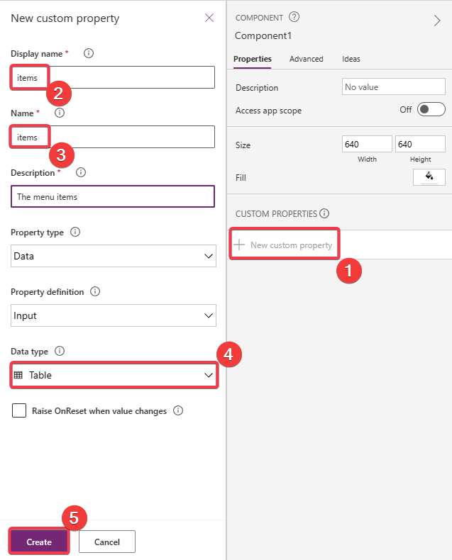

We will now add `colMenu` as the default value for our newly created **items** property.

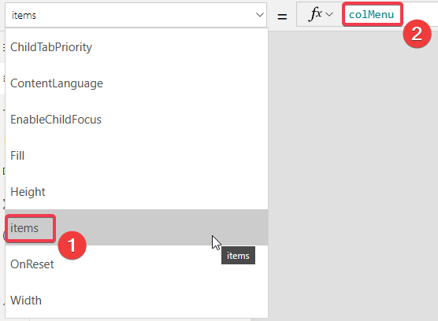

We now select the gallery and change the **Items** property there from `colMenu` to `cmp_Menu.items`. Now we should have access to our collection.

The next property we need is called **selectedID**. We will pass the id of the selected item in there to highlight it in the menu.

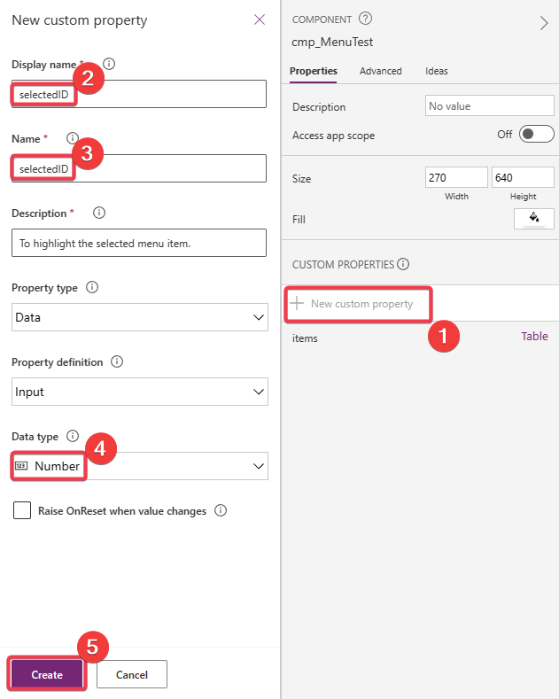

You can select the default value to `1`, which means in our preview the menu should be selected.

Go to the **FontWeight** property of the button and set it to:

```
If(
    ThisItem.id = cmp_Menu.selectedID,
    FontWeight.Bold,
    FontWeight.Lighter
)
```

Your component should look like this:

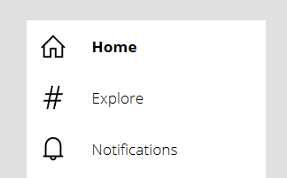

Note: If you completed the side quests of the first exercise you have to change the svg-images as well.

### 3. Add a behavior property

Now we need to change the **OnSelect** property of the button so we can freely change it without touching the component.

We will use a behavior property for that (which are now called `Action` properties).

The **Return data type** is not important, because we won't return data. But we will need to specify a parameter. We will call it **id** and define it as a `number`. We will pass the selected menu item id through this parameter.

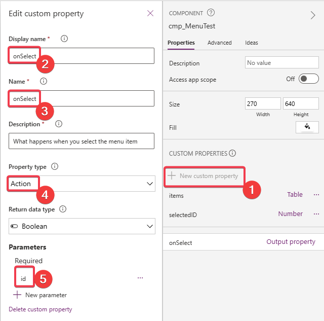

Set the **OnSelect** property of the button to 

```
cmp_Menu.onSelect(ThisItem.id)
```

We can set the default property of our newly created function to something like:

```
Notify($"You selected id {id}")
```

The result should look like this:

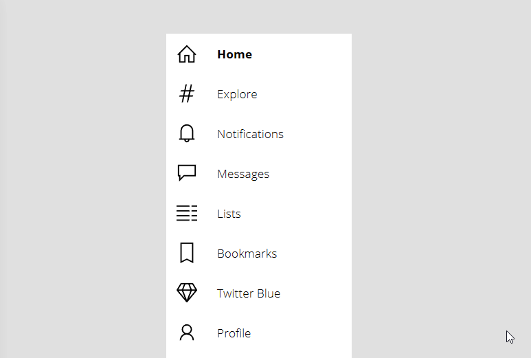


### 4. Expand an retract functionality

Below a certain screen size the twitter menu retracts, hiding the labels of the buttons.

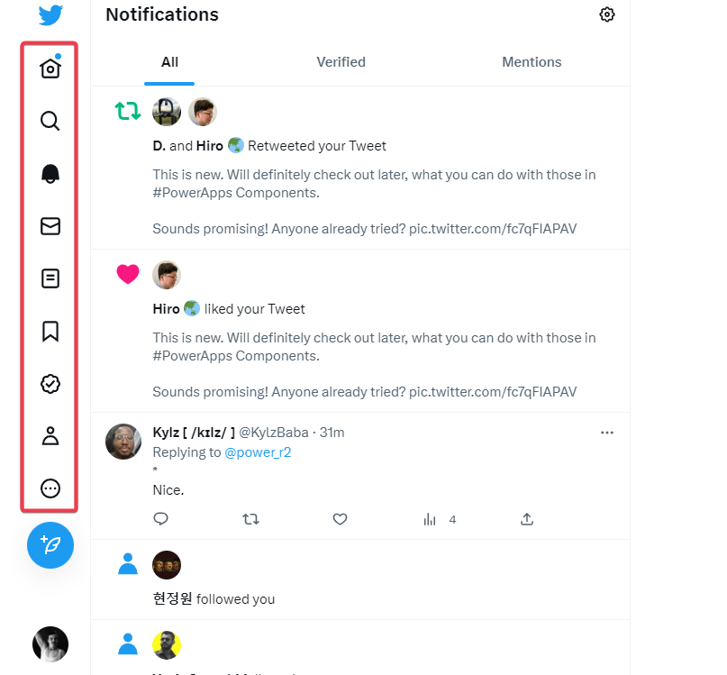

To add this feature to our component we will add a new property, which we will call **expanded**. Make sure it's of the type `Boolean`

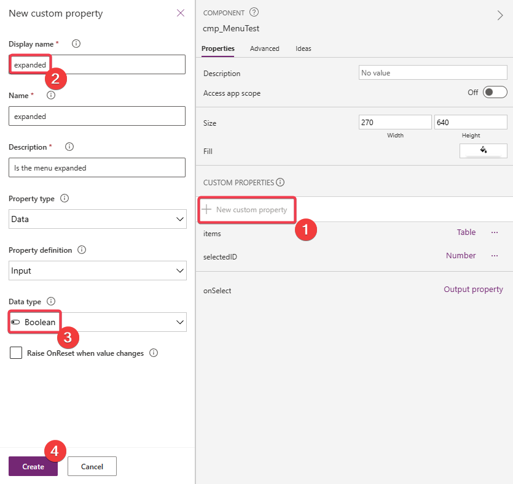

We now can set the **Width** of the component to `If(Self.expanded, 250, 70)`. Now the width of our component changes if we toggle this property.

Next we want to get rid of the Button label if the menu is retracted. Set the **Text** property of the button to `If(cmp_Menu.expanded, ThisItem.text, "")`.

This is also a good moment to set the gallery and the button **Width** to `Parent.Width` to always match the components width.

If we change the **expanded** default value our component should behave like this:

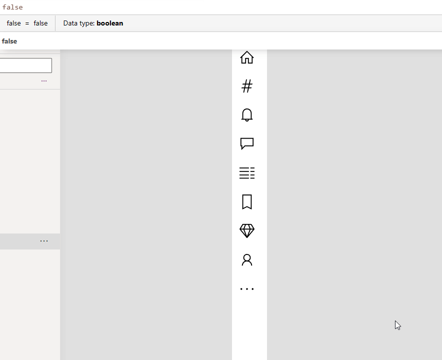


### 5. Insert the component to your app

Pretty straight forward (start playing around with the inpu properties a bit afertwards):

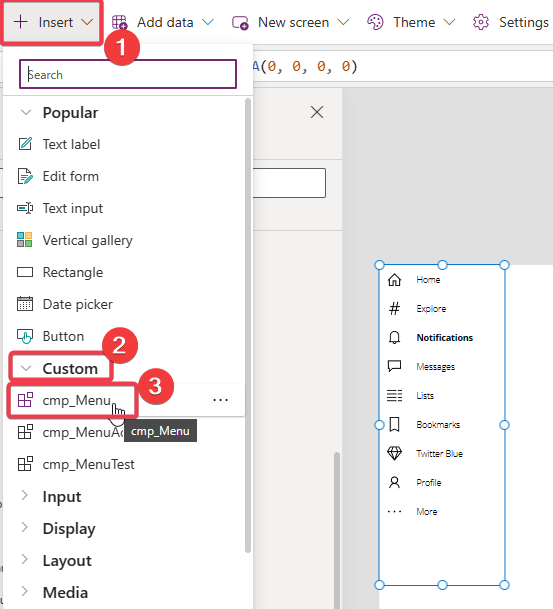

## Side quests

Of course first try to make the menu with the svg's as a component.

Work on the styling a bit and play around with

### Add styling properties

Add more styling properties!

**primaryColorHex**, **textColorHex**, **font** are a good place to start. We will need this to build a dark mode later.

Just a glimpse of what is coming ahead:


Note: I like to use Hexadecimal colors as strings, so we can use them inside svg's. We will need the **textColorHex** for the svg-color.

### Match the exact text widths of the buttons

We are looking for this effect without hard-coding custom width-values into the menu:

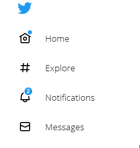

There is no straight forward way to do this. You can find 2 solutions at [Matthew Devaney's blog](https://www.matthewdevaney.com/how-to-make-a-power-apps-auto-width-label/)