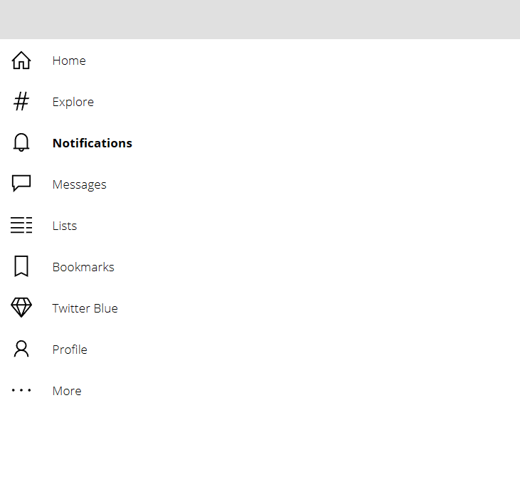

# Exercise 3: Add accessibility features

In the third exercise we will add accessibility features to our menu.


## Main Quests overview

1. Add accessible labels
2. Add keyboard navigation

## Side quests overview

1. Did you really use html-Texts for the svg Icons?
2. Include the messages and notifications into the labels
3. Add a dark and high contrast mode

## Main quests

This one is a bit shorter, but important! We already set everything up nicely in the steps before so we just need to add Accessible labels

### 1. Add accessible labels

We won't need accessible labels, when the menu is expanded, because the screen reader will read the button labels. But if the menu is retracted we will need to use them. So let's make sure that in any case the menu items label will be announced exactly once.

We will set the **AccessibleLabel** of the icon to `If(!cmp_Menu.expanded, ThisItem.text, "")`

Take some time to actually try it out. Use the windows screen reader to let it read it to you in both states after publishing the app. (The in built Edge Screen reader won't pick up Accessible Labels)


### 2. Add keyboard navigation

Go to the button and set the **FocusedBorderColor** to `Color.Gray` and the **FocusedBorderThickness** to `2`.

Try to make sure navigating with `Tab` and `Shift-Tab` moves the focused border up and down and selecting with `Enter` triggers your event.



## Side quests

### Did you really use html-Texts for the svg Icons?

If you did there are sadly no Accessible Labels for HTML Texts. But there are workarounds that are picked up by screen readers.

You could either place a transparent label, which will be picked up by the screen reader.

The other possibility is to add html-code directly into the **HTMLText** that will be picked up.

This code works:

```
$"<svg width='24px' height='24px' viewBox='0 0 24 24' fill='{cmp_MenuAccessible.textColorHex}' role='img' aria-labelledby='title'>
    <title id='title'>{If(!cmp_MenuAccessible.expanded, ThisItem.text)}</title>    
    <path role='presentation' d='{If(ThisItem.id <> cmp_MenuAccessible.selectedID, ThisItem.svg_path, ThisItem.svg_selected)}'>
</svg>"
```

### Include the messages and notifications into the labels

Add to the Accessible labels if there are news in "Home" or "Notifications".

### Add a dark and high contrast mode


Reminder: Collections and galleries are your friends. Store the needed Colors in a collection and change the mode using a gallery.