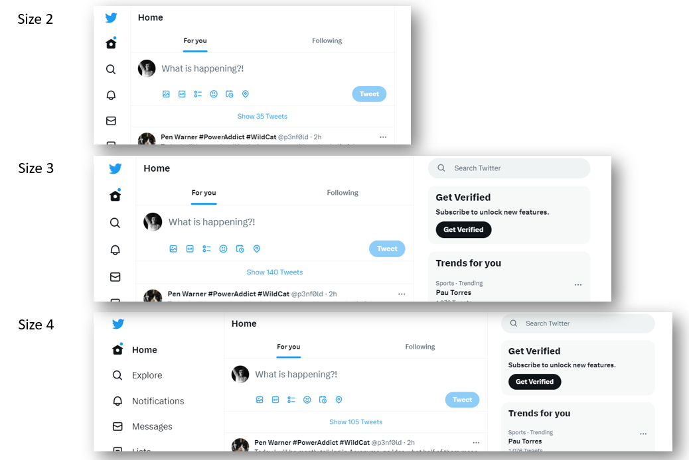
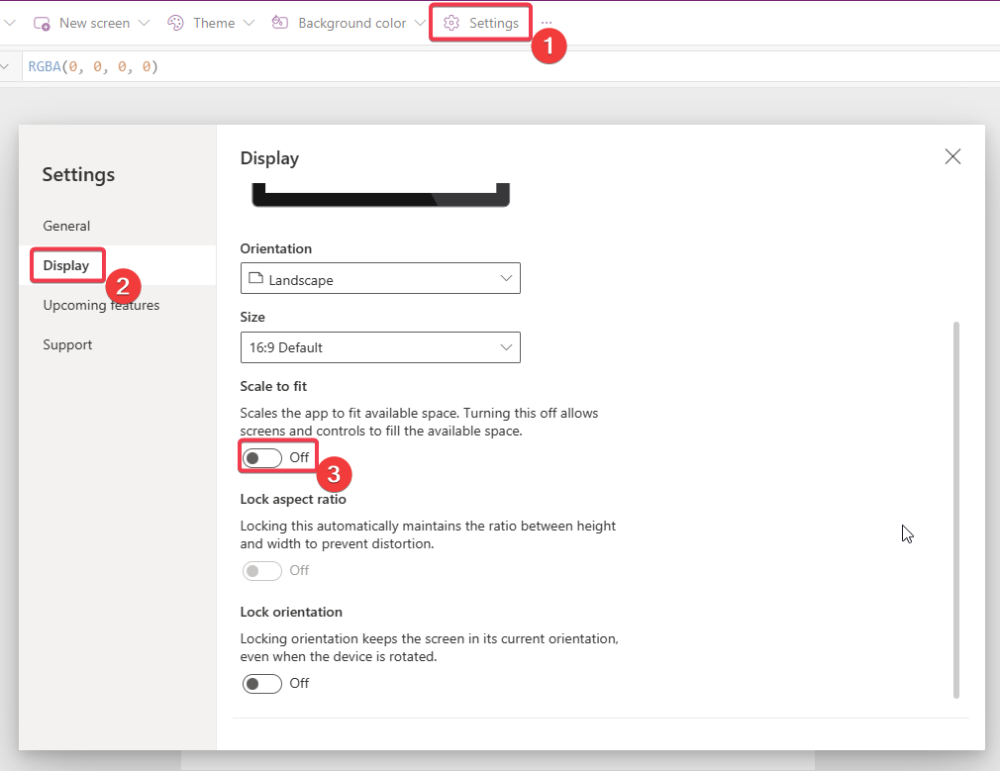
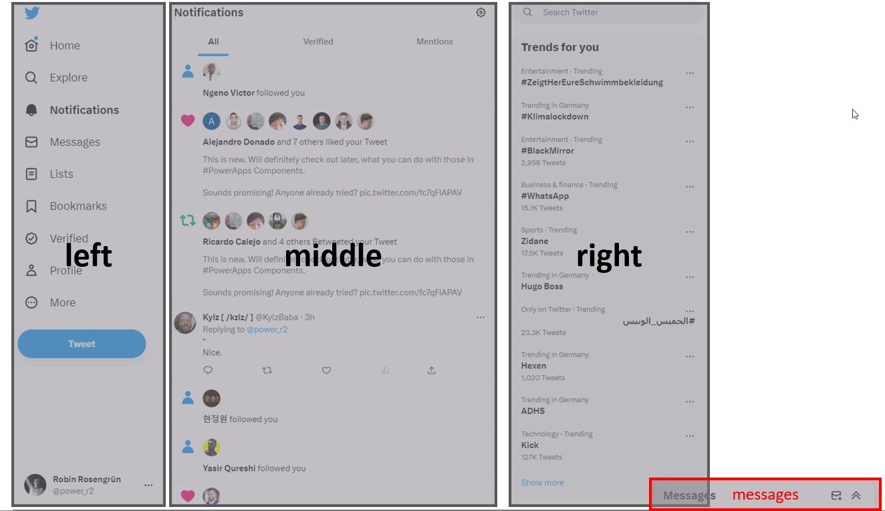
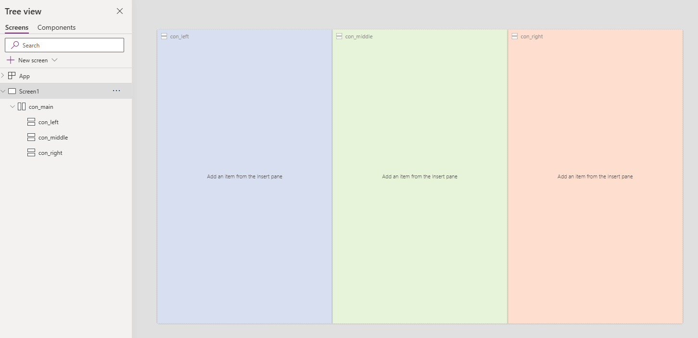
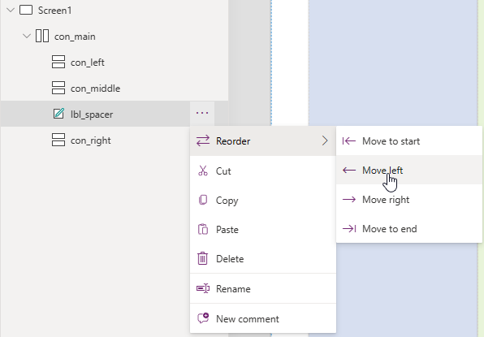
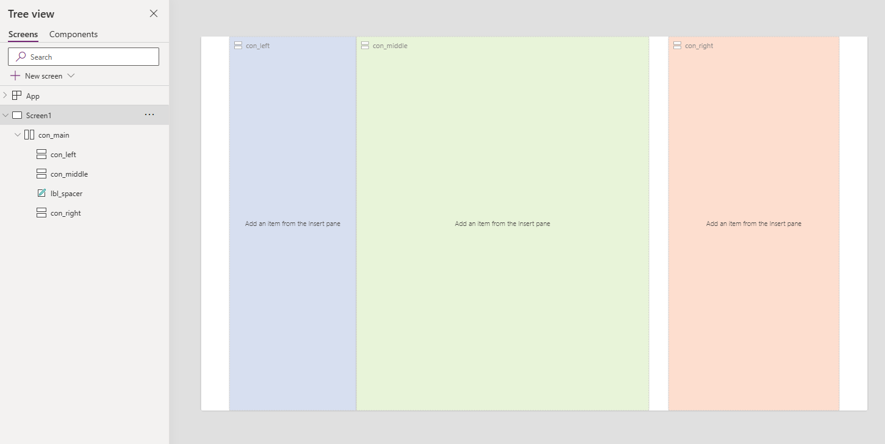
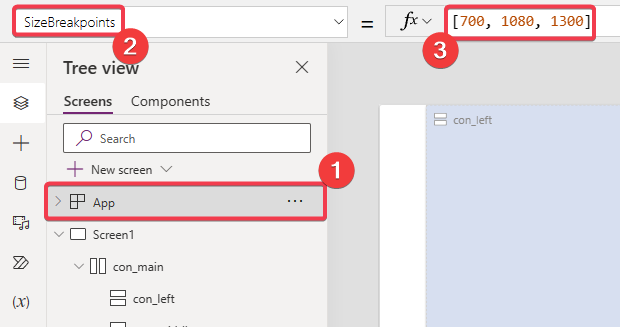
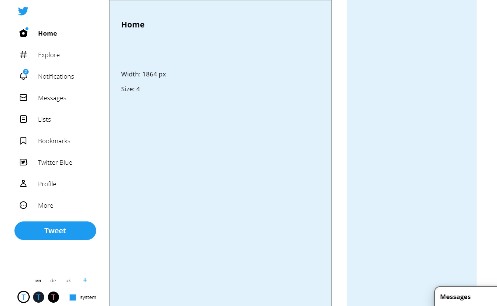
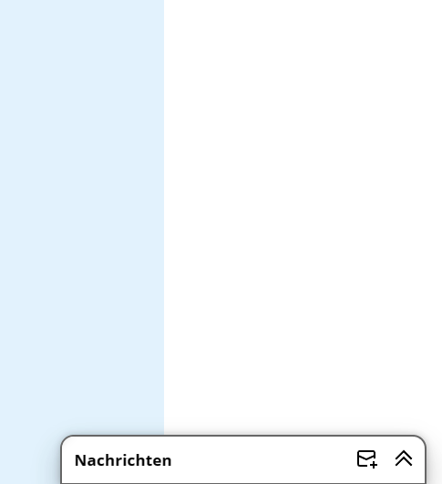
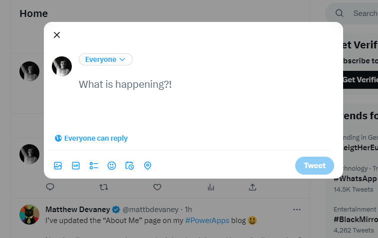

# Exercise 5: Create a responsive screen

In the last exercise we want to use containers to create a responsive screen. Again we are trying to copy the twitter page.

The twitter page has roughly 4 different layouts depending on its size.

Size 1 is for mobile with a menu on the bottom (not shown).

The other 3 look like this:

## Main Quests overview

1. Identify the main containers
2. Create a container structure for the largest screen
3. Add size breakpoints
4. Show and hide the containers depending on size

## Side quests overview

1. Add our component and a bit more
2. Add the messages box
3. Add the mobile view
4. Add a tweet overlay

## Main quests

First of all we change the settings of our app, so our window will behave responsive.

In the display settings we turn **Scale to fit** `off`. This will allow Power Apps to always use the available space to display our app.

### 1. Identify the main containers

We won't display too much detail, but want to use the main containers twitter consists of.

The **left** container is the home of the menu, tweet-button ad logo.

In the **middle** container we will have the timeline or other elements we selected in the menu (we won't actually build anything detailed here).

The **right** container shows the trends and a search bar.

The **messages** container floats in the bottom right corner and is expandable to the top.

### 2. Create a container structure for the largest screen

We will create the structure for the **left**, **middle** and **right** container.

First we create a new `horizontal Container` which will contain the other 3. We will call it `con_main`.

Set the **Width** to `Parent.Width` and **Height** to `Parent.Height`, which makes sure that it always fills the whole screen.

We also set **LayoutJustifyContent** to `LayoutJustifyContent.Center` to make sure we will center everything if there is leftover space.

Next we will create 3 `vertical Container` we will call `con_left`, `con_middle`and `con_right`. We will set the **Height** of all of those to `Parent.Height`. And we will add some semi-transparent fill-colors, so we can distinguish them better.

The result should look like this:

We will turn the **Flexible width** of all containers `off`. (That sets **FillPortions** to `0`).

We set the following **Width** for the containers:
* left: `260`
* middle: `600`
* right: `350`

When you look closely at the twitter page you will notice a gap between the middle and right container.

We will add a label to `con_main` and call it `lbl_spacer`. Delete the **Text** and set **Width** to `40`. We know place it between `con_middle` and `con_right`.

The result should look like this:

### 3. Add size breakpoints

We will now define the **SizeBreakpoints** of our **App** Object. We will set them to `[700, 1080, 1300]`.

This means we want to distinguish between 4 different Layouts:
* `Size1`: **ScreenWidth** smaller 700 px
* `Size2`: **ScreenWidth** bigger 700 px, but smaller 1080 px
* `Size3`: **ScreenWidth** bigger 1080 px, but smaller 1300 px
* `Size4`: **ScreenWidth** bigger 1300 px

Layoutwise this means for us:
* `Size4`: everything visible and at full size
* `Size3`: everything visible and `con_left` at reduzed size
* `Size2`: `con_right` hidden and `con_left` at reduzed size
* `Size1`: mobile (we'll leave that for the side quest)

### 4. Show and hide the containers depending on size

For the last step we simply need to hide the obejcts we don't need for our layout.

We set the **Visible** property of `con_right`and `lbl_spacer` to `Screen1.Size >=3`.

Now we set the **Width** of `con_left` to `If(Screen1.Size=4, 260, 80)`.

And that is it, we successfully created the frame of our responsive layout. Publish your App and try it out in the browser and on your phone and start filling it with content in the side quests.

## Side quests

### 1. Add our component and a bit more

Add as much as you like.

### 2. Add the messages box

Build a message box that hovers in the bottom right corner in `Size4`.

### 3. Add the mobile view

Add a simple mobile view that just consists of `con_middle` and a horizontal menu underneath.

### 4. Add a tweet overlay

Great exercise to use more nested containers:

